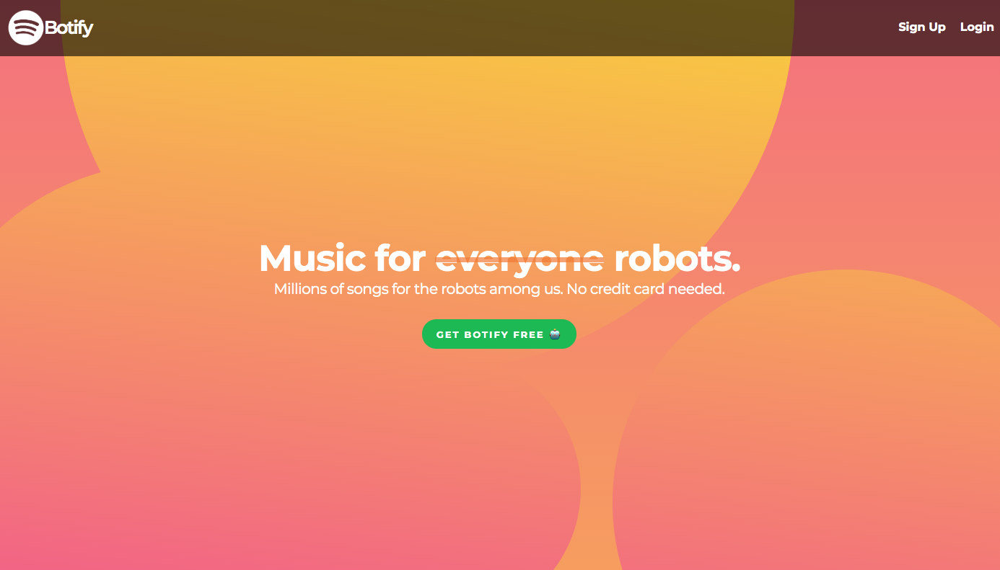
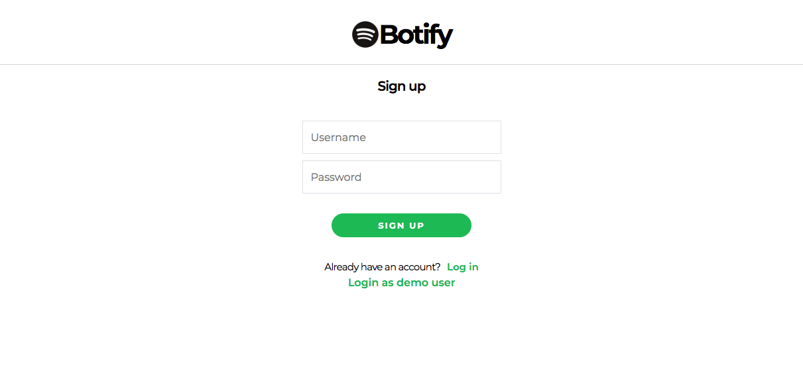
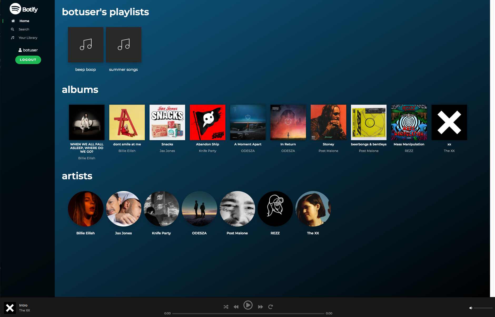

# Botify

[Botify Live Link](https://bot-ify.herokuapp.com/#/)

## Overview

Botify is a full stack clone of Spotify. Create your own playlist, browse albums and artists through your library, and stream any song!

## Technologies

### Frontend
* React
* Redux
* Javascript
* Sass

### Backend
* Ruby on Rails
* PostgreSQL
* AWS S3

### Hosting
* Heroku

### Libraries
* jQuery for API calls
* BCrypt for user authentication

## Key Features
* Sign up and log in

* Create playlists and add songs to it from anywhere!

* Browse albums, artists, and songs

* Stay listening to your current song throughout navigation. Click back and next to go to the next song in the queue!

## To Do
* Search functionality
* Follow functionality
